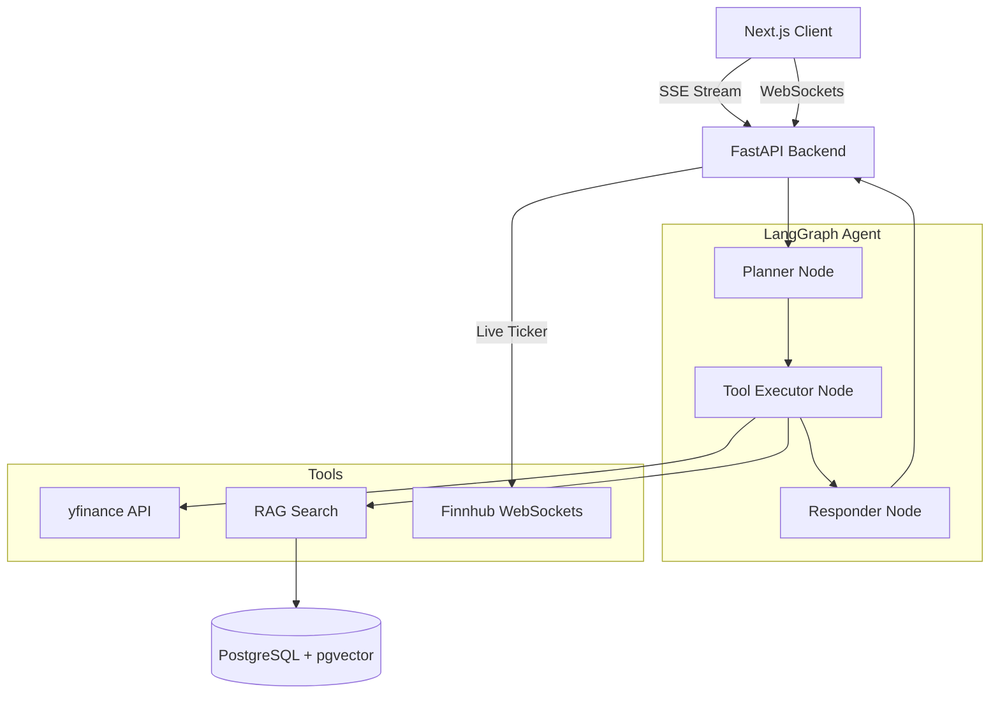

# FinSight

FinSight is an agentic financial research assistant designed to answer natural-language questions about US and Indian equities. Rather than relying on a generic LLM system prompt, FinSight employs a custom-built LangGraph agent that seamlessly combines live market data fetching with cited retrieval over real annual reports. The system returns verifiable, deterministic financial data rendered into bespoke UI components over a streaming Server-Sent Events (SSE) connection, ensuring that every claim is cited and every tool call is completely transparent to the user.

---

## Features

### AI Orchestration
- **Custom Agent Graph:** A fully hand-written LangGraph execution flow (Planner → Tool Executor → Responder) instead of generic wrappers like `create_react_agent`.
- **Deterministic UI Generation:** The LLM focuses exclusively on analytical prose. A parallel Python pipeline strictly maps tool outputs into typed, Zod-validated UI components to prevent JSON-generation hallucinations.

### Live Market Data
- **Multi-Market Support:** Live price streams, historical charts, financial ratios, and news coverage for both US and Indian (NSE/BSE) equities via `yfinance`.
- **Intelligent Ticker Normalization:** Automatically handles `.NS`/`.BO` exchange suffixes for Indian markets.

### RAG & Retrieval
- **Keyword Pre-Filtering:** PDF ingestion dynamically drops low-value pages (e.g., table of contents) that lack financial relevance prior to chunking, optimizing embedding costs and search density.
- **Vector Search:** HNSW indexing in PostgreSQL via `pgvector` for sub-millisecond similarity search over cited annual reports.

### Real-Time Infrastructure
- **SSE Streaming:** Chat interface renders real-time progressive updates (Status → Tool Calls → Token Prose → UI Blocks).
- **Bidirectional WebSockets:** Live, client-cancellable WebSocket streams for the document ingestion pipeline.
- **Upstream WebSockets:** Backend-to-Finnhub WebSocket integration for live price ticking.

---

## Demo

> *Note: Add your Vercel URL and Render API URL here.*
> 🔗 **Live Demo:** [Vercel Deployment](#)
> 🔗 **API Health Check:** [Render Endpoint](#)

---

## Architecture

FinSight operates on a decoupled architecture where the Next.js frontend communicates with a FastAPI backend. The backend manages the LangGraph agent, state persistence in PostgreSQL, and real-time data ingestion.



---

## Request Flow

A user's chat query traverses a highly structured lifecycle designed for visibility and fault tolerance:

1. **User Request:** The Next.js frontend sends a natural language query via an SSE endpoint.
2. **API Endpoint (`/api/v1/threads`):** FastAPI initializes an asynchronous database session and streams a `status` event to the client.
3. **Planner Node:** The LLM interprets the query, normalizes stock tickers, and decides which tools to invoke.
4. **Tool Executor Node:** The system executes the requested tools (`yfinance`, RAG queries). Crucially, any tool failures are caught and injected back into the state as error strings, preventing a graph crash.
5. **Retriever (If Applicable):** For RAG queries, semantic search is executed against the `pgvector` database to pull the most relevant document chunks.
6. **Responder Node:** 
   - **Prose:** The LLM receives the verified tool outputs and streams conversational analysis tokens to the client.
   - **Structured UI:** A deterministic Python builder inspects the tool trace and constructs structured `ui_block` JSON payloads for the frontend.
7. **Frontend Rendering:** The client parses the SSE stream, rendering markdown prose and hydration-safe React components (`StockOverview`, `ResearchCard`, etc.).

---

## Tech Stack

### Languages
- **Python 3.10+** (Backend)
- **TypeScript** (Frontend)

### Frameworks
- **FastAPI / Uvicorn** (High-performance async backend API)
- **Next.js App Router** (React frontend)
- **TailwindCSS** (Utility-first styling)

### AI & Data Pipeline
- **LangGraph & LangChain** (Agent orchestration and provider wrappers)
- **Groq (`llama-3.3-70b-versatile`)** (Primary LLM for planning and response generation)
- **HuggingFace Inference API (`BAAI/bge-base-en-v1.5`)** (768-dimensional text embeddings)
- **`pdfplumber`** (PDF text extraction)

### Database
- **PostgreSQL** (Managed by Neon)
- **`pgvector`** (Cosine similarity vector indexing)
- **SQLAlchemy (async) & Alembic** (ORM and migrations)

### Visualization
- **Recharts** (Interactive charting for price history)
- **Zod** (Strict runtime schema validation for UI blocks)

---

## Folder Structure

```text
.
├── backend/
│   ├── alembic/              # Database migration scripts
│   ├── app/
│   │   ├── agent/            # LangGraph nodes, tools, and LLM wrappers
│   │   ├── api/v1/           # FastAPI routers and SSE/WebSocket endpoints
│   │   ├── models/           # SQLAlchemy ORM definitions
│   │   ├── schemas/          # Pydantic validation schemas
│   │   └── services/         # Core business logic (chat, live price bus)
│   ├── scripts/              # Standalone CLI tools (e.g., seed_documents.py)
│   ├── main.py               # Application entrypoint and lifespan
│   └── render.yaml           # Deployment configuration
└── frontend/
    ├── src/
    │   ├── app/              # Next.js App Router pages
    │   ├── components/       # UI Components (Generative UI, Base UI)
    │   ├── hooks/            # Custom React hooks (usePriceStream, etc.)
    │   ├── lib/              # Utilities and API clients
    │   └── stores/           # Global state management
    ├── package.json
    └── tailwind.config.js
```

---

## Core Components

- **Agent (`backend/app/agent/`)**: The brain of the application. Contains the `build_graph()` logic connecting the `Planner`, `Tool Executor`, and `Responder`. Tools like `get_financials.py` and `rag_search.py` are defined here.
- **Generative UI Registry (`frontend/src/components/generative-ui/`)**: A strictly typed React component registry. It maps the backend's deterministic JSON blocks (like `StockOverview` and `ResearchCard`) to their respective rendering logic, validating incoming props with Zod schemas.
- **Price Bus (`backend/app/services/price_bus.py`)**: A centralized WebSocket service that streams live ticker data from Finnhub to all active frontend clients, avoiding redundant upstream connections.

---

## API Endpoints

| Method | Route | Purpose | Authentication |
|---|---|---|---|
| `POST` | `/api/v1/threads` | Initialize a new chat thread | Public |
| `POST` | `/api/v1/threads/{id}/messages` | Stream agent responses via SSE | Public |
| `GET` | `/api/v1/chart/{ticker}` | Fetch historical price data | Public |
| `GET` | `/api/v1/market/brief` | Fetch a high-level market summary | Public |
| `POST` | `/api/v1/documents/upload` | Upload a PDF for ingestion | Public |
| `GET` | `/api/v1/health` | Service health check | Public |

---

## WebSocket Architecture

WebSockets are utilized exclusively where real-time, low-latency bidirectional communication is an architectural necessity:

1. **Document Ingestion (`/api/v1/ws/documents/{id}`)**
   - **Why:** Document parsing, filtering, chunking, and embedding is a long-running background process.
   - **Flow:** The client opens a WebSocket connection to monitor live progress. It is fully bidirectional—if the user navigates away or clicks "Cancel," the client sends a `{"action": "cancel"}` payload, and the server immediately aborts the embedding loop to save compute.
2. **Finnhub Integration (`backend/app/api/v1/ws_prices.py`)**
   - **Why:** Finnhub's live market data API requires a WebSocket connection.
   - **Flow:** The backend establishes a single persistent upstream WebSocket to Finnhub during the application lifespan. It then multiplexes this single stream down to any connected frontend clients via a broadcast system, preserving upstream rate limits.

---

## Database

FinSight uses a Neon Serverless PostgreSQL database.

- **`threads` & `messages`:** Persist the chat history and the LangGraph checkpoints, enabling long-running conversational memory.
- **`documents` & `document_chunks`:** Store the ingested annual reports. 
- **Vector Storage:** The `document_chunks` table utilizes `pgvector` with a 768-dimensional `embedding` column. It features an HNSW (Hierarchical Navigable Small World) index configured with `vector_cosine_ops` to enable extremely fast, scalable similarity search.

---

## AI & RAG Pipeline

### Agentic Flow
1. **Planner:** Normalizes inputs and issues parallel tool execution commands.
2. **Execution:** Tools run and return raw data.
3. **Responder:** Analyzes the tool trace. If a query requires UI generation (like fetching a stock price), a standalone Python function deterministicially maps the tool output into a `UIBlock` JSON payload, preventing the LLM from hallucinating invalid UI states.

### Retrieval-Augmented Generation (RAG)
1. **Ingestion & Filtering:** `pdfplumber` extracts text. A keyword pre-filter aggressively drops pages lacking financial terminology (e.g., "capex", "management discussion") before chunking, drastically reducing embedding costs.
2. **Chunking & Embedding:** `RecursiveCharacterTextSplitter` chunks the remaining text. Batched requests with exponential backoff are sent to HuggingFace Inference API (`BAAI/bge-base-en-v1.5`).
3. **Search & Citations:** Queries execute a cosine similarity search against `pgvector`. The highest-scoring excerpts are surfaced to the LLM and embedded in a `FilingExcerpt` UI block to provide the user with verbatim, verifiable citations.

---

## Installation

### Prerequisites
- Python 3.10+
- Node.js 18+
- A Neon Postgres database with the `vector` extension enabled.
- API keys for Groq and HuggingFace (must have Inference scope).

### 1. Backend Setup

```bash
cd backend
python -m venv venv

# Windows
.\venv\Scripts\Activate.ps1
# Mac/Linux
source venv/bin/activate

pip install -r requirements.txt
```

Create `backend/.env` with your API keys (see [Environment Variables](#environment-variables)).

Run database migrations:
```bash
alembic upgrade head
```

Start the FastAPI server:
```bash
uvicorn app.main:app --reload
```

### 2. Frontend Setup

```bash
cd frontend
npm install
npm run dev
```

### 3. Seeding the Database
Place any PDF annual reports in `seed_filings/` (at the repository root) and run:
```bash
cd backend
python -m scripts.seed_documents
```
*Note: If you change the embedding model, existing `document_chunks` rows must be truncated as they will reside in a different vector space.*

---

## Environment Variables

| Variable | Required | Description | Default |
|---|---|---|---|
| `DATABASE_URL` | Yes | PostgreSQL connection string (Neon recommended). | - |
| `GROQ_API_KEY` | Yes | Groq API key for Llama-3 inference. | - |
| `HUGGINGFACE_API_KEY` | Yes | HuggingFace key for embedding generation. | - |

---

## Future Improvements

- **Ingestion Resumability:** Currently, the seed script retries failed batches, but a killed run must be restarted from the beginning. Adding state-tracking for partially processed documents would improve resilience.
- **Database Connection Pooling:** Hardening the SQLAlchemy configuration with `pool_pre_ping` to better handle Neon's scale-to-zero connection drops.
- **Authentication:** Integrating Clerk or NextAuth for personalized threads and secure document uploads.
- **Verifier Node:** Implementing a rule-based LangGraph node that sanity-checks LLM numeric outputs against the raw tool trace to guarantee zero hallucinated metrics.

---

## Lessons Learned

- **Deterministic UI is Safer than Generative JSON:** Initially, we relied on the LLM to output UI configurations in JSON format. Switching providers highlighted formatting drift (e.g., Llama-3 occasionally leaking markdown into JSON blocks). Moving the `ui_block` payload construction to a deterministic Python function acting *on* the tool trace resulted in 100% structural reliability while letting the LLM focus purely on analysis.
- **Provider Agnosticism Pays Off:** The architecture was originally built on Gemini. Decoupling the LLM orchestration via LangChain's `bind_tools()` abstraction meant migrating to Groq (for chat) and HuggingFace (for embeddings) required changing instantiation code only, without touching the graph logic.
- **Targeted RAG Optimization:** Keyword pre-filtering before chunking proved significantly more cost-effective than embedding entire 300-page SEC filings, demonstrating that preprocessing is often a better lever for optimization than raw vector DB performance.

---

## License

This project is open-source and available under the MIT License.